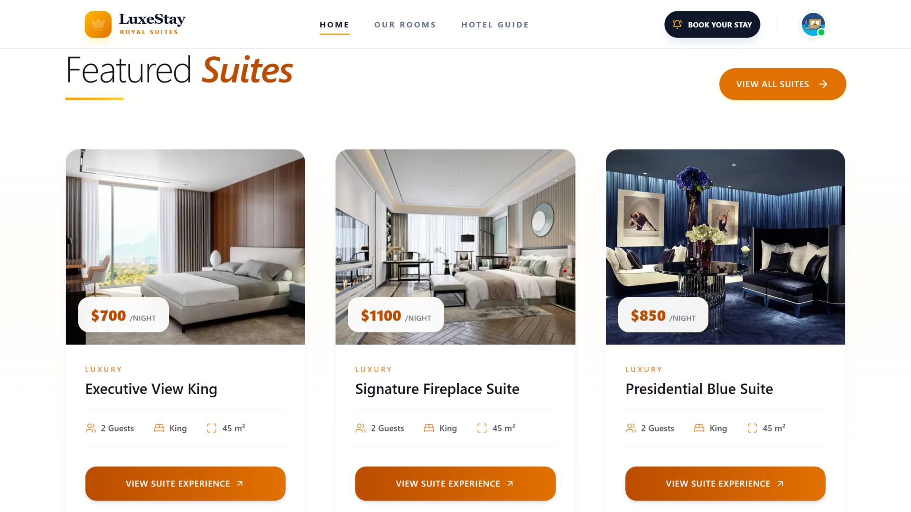
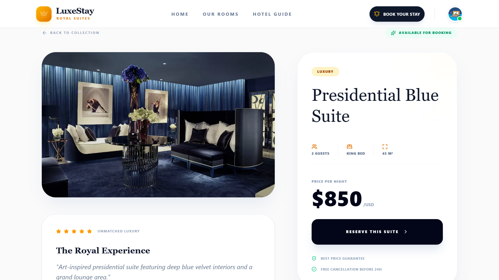
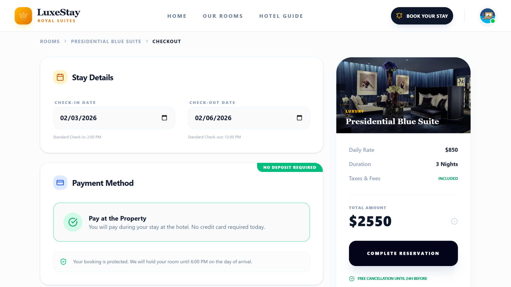
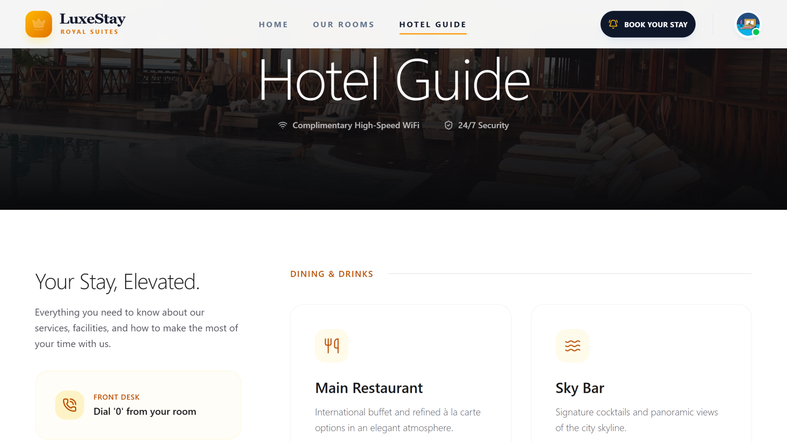
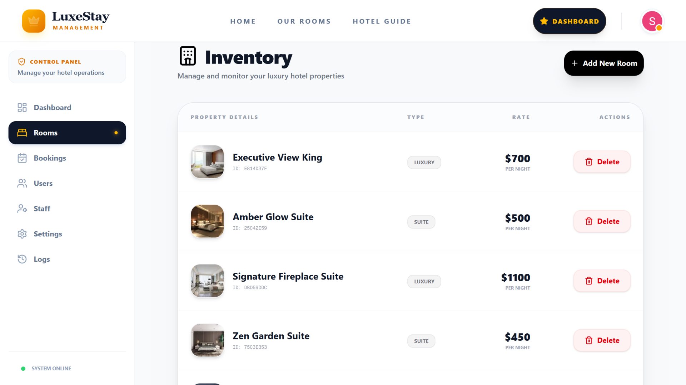

# 🏨 LuxeStay — Premium Hotel Guest Experience Platform

<div align="center">


<br />

[](https://luxestay-guest-platform.vercel.app)
[](https://nextjs.org)
[](https://supabase.com)
[](https://authjs.dev)
[](https://www.typescriptlang.org)

<p align="center">
<strong>
A modern hotel platform designed to elevate the guest experience —
from room discovery to digital concierge services, all in one seamless system.
</strong>
<br />
Built with <b>Next.js 15 (App Router)</b>, <b>TypeScript</b>, and <b>Supabase</b>.
</p>

</div>

---

## 🚀 Live Demo

  <a href="https://luxestay-guest-platform.vercel.app/">
    
  </a>

---

## 🧠 Project Overview

**LuxeStay** is a full-stack hotel web application simulating a real-world hospitality workflow.

The platform enables guests to:
- 🏨 Explore luxury rooms & suites.
- 📅 Book stays seamlessly with **Pay at Arrival**.
- 👤 Access a personal guest dashboard.
- 🛎️ Use the **Digital Guide** to explore hotel amenities.

While allowing hotel administrators to:
- 🛠️ Manage inventory & pricing in real-time.
- 📊 Monitor bookings and guest stats.
- 🔒 Securely access controls via role-based authentication.

---

## 🖼️ Visual Tour

### 🏠 Landing Page
<p>Elegant hero section showcasing the hotel brand and available rooms.</p>


---

### 🛌 Featured Luxury Suites
<p>A curated showcase of our most exclusive suites, handpicked for guests seeking the ultimate luxury experience.</p>


---

### 🏨 Room Details
<p>Detailed view of room specifications, high-res imagery, and booking options.</p>


---

### 🧾 Checkout — Pay at Arrival
<p>A simplified checkout experience with no online payment required, ensuring trust and speed.</p>


---


### 📖 Interactive Hotel Guide
<p>A digital concierge experience where guests can explore dining options like the <b>Main Restaurant</b> and <b>Sky Bar</b>, or quickly reach the front desk for immediate assistance.</p>


---

### 🛠️ Advanced Inventory Management (Admin)
<p>A powerful control panel for hotel administrators to manage the property inventory. It allows real-time monitoring of suites, price adjustments (e.g., $700/night), and full CRUD operations for room listings.</p>


---


## 📂 Project Structure

Organized following the **Next.js App Router** architecture for scalability.

```bash
app/
├── (auth)/               # Authentication Routes (Login/Register)
├── admin/                # Protected Admin Dashboard & Inventory
├── checkout/[id]/        # Dynamic Booking Flow
├── guide/                # Hotel Digital Guide & Services
├── profile/              # Guest Dashboard (My Stays)
├── rooms/                # Room Browsing & Filtering
│   └── [id]/             # Single Room Details Page
├── layout.tsx            # Root Layout & Providers
└── page.tsx              # Landing Page
components/               # Reusable UI Components
lib/                      # Core Logic
├── services/             # API & Data Fetching Services
├── supabase.ts           # Supabase Client Configuration
└── utils.ts              # Helper Functions


⚙️ Environment Setup
To run this project locally, create a .env.local file in the root directory and add the following keys:
 # 🔐 NextAuth / Auth.js Configuration
AUTH_SECRET="your_generated_secret_here"
NEXTAUTH_URL="http://localhost:3000"

# 🌐 Google OAuth Provider
AUTH_GOOGLE_ID="your_google_client_id"
AUTH_GOOGLE_SECRET="your_google_client_secret"

# 🗄️ Supabase Database (Public & Private Keys)
NEXT_PUBLIC_SUPABASE_URL="[https://your-project.supabase.co](https://your-project.supabase.co)"
NEXT_PUBLIC_SUPABASE_ANON_KEY="your_public_anon_key"
SUPABASE_SERVICE_ROLE_KEY="your_service_role_key"


🛠️ Tech Stack & Tools
Frontend
Framework: Next.js 15 (App Router)

Language: TypeScript

Styling: Tailwind CSS + Custom Animations

Icons: Lucide React

Backend & Auth
Database: Supabase (PostgreSQL)

Authentication: NextAuth (with Google Provider & Supabase Adapter)

Security: Row Level Security (RLS) & Protected Middleware

🤝 Contributing
Contributions are welcome! Please feel free to submit a Pull Request.
